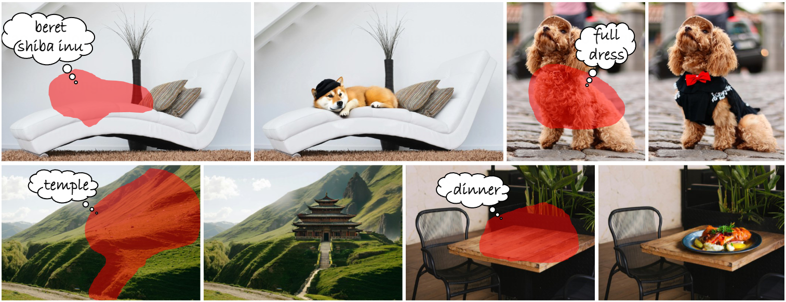
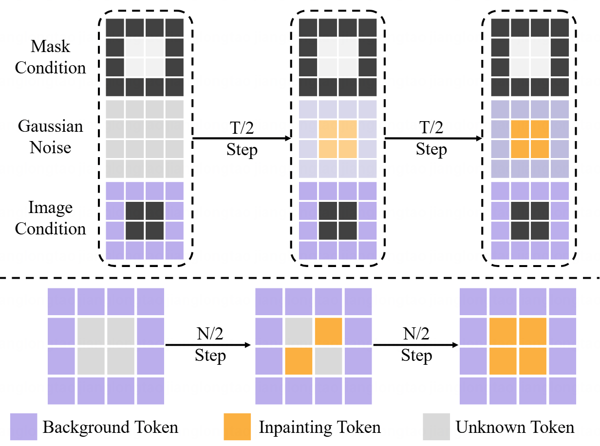

# Token Painter: Training-Free Text-Guided Image Inpainting via Mask Autoregressive Models (AAAI 2026)

[Longtao Jiang](https://longtaojiang.github.io/), [Jie Huang](https://huangkevinj.github.io/), [Mingfei Han](https://mingfei.info/), [Lei Chen](https://scholar.google.com/citations?user=l4QgYBIAAAAJ&hl=zh-CN), [Yongqiang Yu](), [Feng Zhao](https://scholar.google.com/citations?user=r6CvuOUAAAAJ&hl=en), [Xiaojun Chang](https://www.xiaojun.ai/), [Zhihui Li†](https://www.zhihui.li/),

Arxiv: [https://arxiv.org/abs/2509.23919](https://arxiv.org/abs/2509.23919)

**Your star means a lot for us to develop this project!** :star:

Token Painter is a training-free text-guided image inpainting model built upon the Mask AutoRegressive (MAR) paradigm. Unlike diffusion-based methods that model the entire image in latent space and often struggle with prompt alignment and background consistency, Token Painter focuses on locally generating masked regions while preserving the unmasked background. To achieve this, Token Painter introduces two key components: Dual-Stream Encoder Information Fusion (DEIF), which fuses semantic and contextual information from text and background in the frequency domain to produce effective guidance tokens, and Adaptive Decoder Attention Score Enhancing (ADAE), which adaptively strengthens attention on guidance and inpainting tokens to improve prompt fidelity and visual coherence. Through extensive experiments, Token Painter demonstrates superior performance and robustness across nearly all benchmarks, achieving state-of-the-art results in text-guided image inpainting.

## News

- [2025/11/08] :tada: Token Painter is accepted by AAAI 2026.
- [2025/09/28] :sparkles: Release [paper](https://arxiv.org/abs/2509.23919).

## TODO

- [ ] Release Inference models.
- [ ] Release Inference pipelines.

## Abstract
> Text-guided image inpainting aims to inpaint masked image regions based on a textual prompt while preserving the background. Although diffusion-based methods have become dominant, their property of modeling the entire image in latent space makes it challenging for the results to align well with prompt details and maintain a consistent background.
To address these issues, we explore Mask AutoRegressive (MAR) models for this task. MAR naturally supports image inpainting by generating latent tokens corresponding to mask regions, enabling better local controllability without altering the background. However, directly applying MAR to this task makes the inpainting content either ignore the prompts or be disharmonious with the background context. Through analysis of the attention maps from the inpainting images, we identify the impact of background tokens on text tokens during the MAR generation, and leverage this to design \textbf{Token Painter}, a training-free text-guided image inpainting method based on MAR.
Our approach introduces two key components: (1) Dual-Stream Encoder Information Fusion (DEIF), which fuses the semantic and context information from text and background in frequency domain to produce novel guidance tokens, allowing MAR to generate text-faithful inpainting content while keeping harmonious with background context. (2) Adaptive Decoder Attention Score Enhancing (ADAE), which adaptively enhances attention scores on guidance tokens and inpainting tokens to further enhance the alignment of prompt details and the content visual quality. Extensive experiments demonstrate that our training-free method outperforms prior state-of-the-art methods across almost all metrics.

<p align="center">

</p>

## Comparison of diffusion-based Methods and Token Painter
<p align="center">

</p>

## Token Painter Framework
<p align="center">

</p>


## 📍 Citation 

```
@misc{jiang2025tokenpaintertrainingfreetextguided,
      title={Token Painter: Training-Free Text-Guided Image Inpainting via Mask Autoregressive Models}, 
      author={Longtao Jiang and Mingfei Han and Lei Chen and Yongqiang Yu and Feng Zhao and Xiaojun Chang and Zhihui Li},
      year={2025},
      eprint={2509.23919},
      archivePrefix={arXiv},
      primaryClass={cs.CV},
      url={https://arxiv.org/abs/2509.23919}, 
}
``` 

## 💗 Acknowledgements

This repository borrows heavily from [NOVA](https://github.com/baaivision/NOVA). Thanks to the authors for sharing their code and models.

## 🧿 Maintenance

This is the codebase for our research work. We are still working hard to update this repo, and more details are coming in days. If you have any questions or ideas to discuss, feel free to contact [Longtao Jiang](taotao707@mail.ustc.edu.cn).
